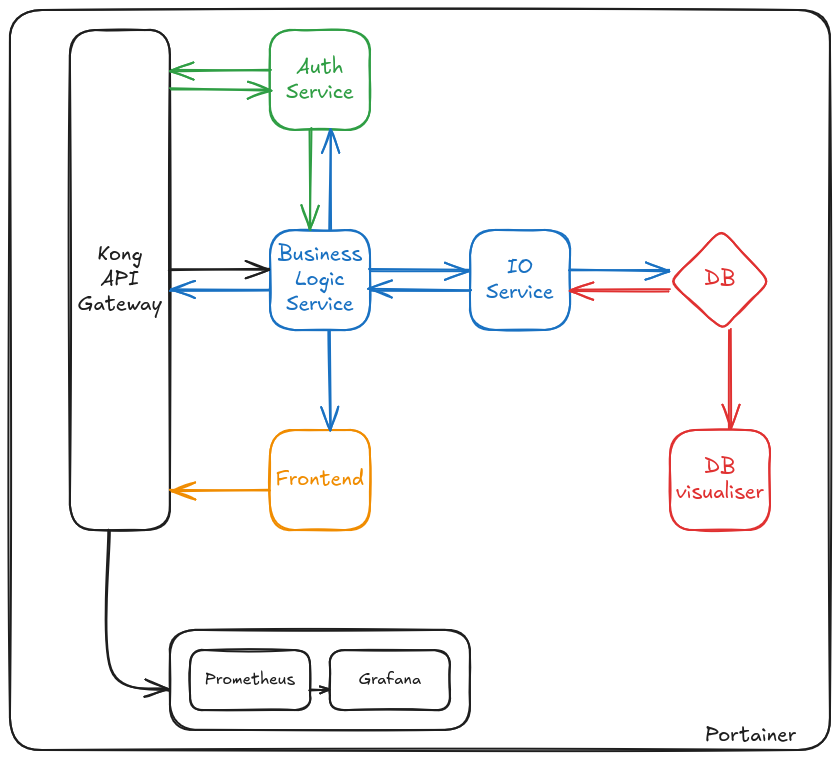
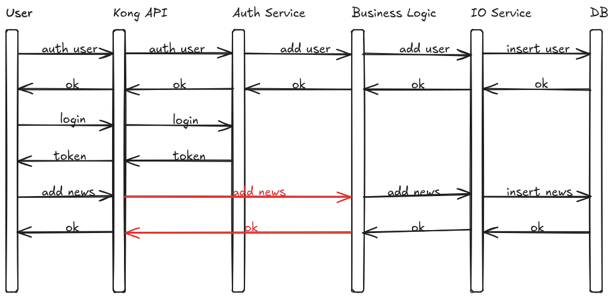

# FakeAcad

|    | | |
|--------------|:-----:|:-----------:|
| Lab Teacher |  Radu Ciobanu |
| Devs | Maria Sfîrăială, 341C3 | Albert-Timotei Daraban, 341C3 |

## Description

**FakeAcad** is a web platform designed to make sharing news about fake academic discourse easier.
It targets the academic audience in order to spread awareness about fake results in papers and publications, incorrect and obsolete information in courses and labs, unlawful and dishonest practices in Academia.

Users can creat accounts, log in and start sharing fake discourse relating to academic backgrounds.
The information must be backed-up by evidence, and is thoroughly checked by a moderator (be that a human or AI instance).
Every piece of news has its own page and is categorized under a university of provenance.
Each university index holds stats about the quality of its discourse: an honesty grade for papers, publications, courses, labs and practices, together with the professors and staff that are known to be lacking sincerity.

## Platform Architecture

*Platform Architecture*

*Platform Flow*

## Microservices

1. `Kong API Gateway`

    * manage and secure the access 

1. `Auth Service`

    * authenticate and login users

1. `Business Logic Service`

    * manage data influx

1. `IO Service`

    * manage the connection to the DB
    * fetch from the DB
    * populate the DB

1. `DB`

    * store platform information: news, evidence, professors, staff, university, sincerity indeces

1. `DB visualiser`

    * visualise the database in a user-friendly manner

1. `Prometheus`

    * collect performance and logging data

1. `Grafana`

    * visualise performance and logging data

## Responsabilities

| Responsability | Maria Sfîrăială | Albert-Timotei Daraban |
|--------------|:-----:|:-----------:|
| Kong API | x |  |
| Auth Service | x | x |
| Business Logic Service | x | x |
| IO Service | x | x |
| DB | x |  |
| DB visualiser | x |  |
| Prometheus |  | x |
| Grafana |  | x |
| Portainer |  | x |
| CI/CD | x |  |

## Useful Links

* [Organization](https://github.com/fake-academic-discourse/)

* [FakeAcad](https://github.com/fake-academic-discourse/FakeAcad)
